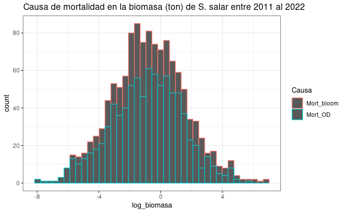

```{r setup, include=FALSE, comment=TRUE}
knitr::opts_chunk$set(echo = FALSE)
library(knitr)
library(kableExtra)
library(ggplot2)
library(dplyr)
library(readxl)
library(stats)
library(tidyr)
library(pander)
library(lmtest)
library(gridExtra)
library(multcomp)
library(car)
```


## **Estructura del trabajo exploratorio y estadístico**

**1).** **Introducción**

- Descripción de la problemática.
- Variables de estudio y número de observaciones.

**2).** **Análisis exploratorio de los datos**

- Histogramas biomasa muerta (toneladas) por causa.
- Boxplot biomasa muerta por causa para los últimos 10 años.

**3).** **Análisis estadísitico de los datos**

- Modelos lineales simples y múltiple.
- Comparación de modelos RSS-AIC.

**4).** **Interpretación y conclusiones del trabajo**


## **Introducción**

**1).** **Descripción de la problemática**

- Base de datos presenta registros de mortalidad por causa **bloom de algas y disminución de oxígeno disuelto (OD)**. 
- 23 centros de cultivos reportaron la causal de mortalidad en salmón para un barrio de la Región de Los Lagos.
- *Salmo salar* es la especie más cultivada en este barrio.

**2).** **Variables de estudio y número de observaciones**

- Los registros corresponden a reportes de mortalidad entre los años 2011 e incio del 2022 (Total de registros= 1224).
- Variables de estudio: Causa, peso (g), años, mes, semana e identificación de centro de cultivo.


## **Objetivos del estudio**

- Evaluar la causa de mortalidad por bloom de algas y OD sobre la especie *Salmo salar* para un barrio del sur de Chile entre los años 2011 a inicios del 2022. 
- Generar un modelo lineal que mejor ajuste la predicción de mortalidad en la biomasa de salmones.


## **Análisis exploratorio de los datos**

- Entre los periodos 2011 a 2022 existe una mayor biomasa muerta (ton) de *S. salar* en el barrio por causa de la acción de bloom de algas.

- Datos desbalanceados por causa de muertes debido a bloom de algas (n= 360) y OD (n= 864).

- Año 2021 con mayor biomasa muerta.

- No existe correlación significativa (p<0.05) entre las causas de muerte por bloom de algas y disminución de oxígeno disuelto.


## **Análisis exploratorio de los datos: Histograma**

```{r, echo = FALSE, out.width= '60%', fig.align='center', fig.cap= "Histograma biomasa muerta (toneladas) por causa"}

```


## **Análisis exploratorio de los datos: Boxplot**

- Datos faltantes para la causa de mortalidad por bloom entre el periodo 2011 a 2022.

- Valores atípicos presente en las dos causas de mortalidad.

```{r, echo = FALSE, out.width= '60%', fig.align='center', fig.cap= "Boxplot biomasa muerta por año y causa"}
knitr::include_graphics("boxplot_biomasa_muerta_año.png")
```


## **Análisis exploratorio de los datos: Plot**

- Evidencia sobre la ocurrencia de un evento temporal puntual que generó una alta mortalidad en la biomasa de salmones.

- Año 2021 presentó la mayor biomasa de salmones muertos siendo afectada por la **acción de bloom de algas**.

- Año 2021 presentó la mayor mortalidad registrada históricamente en este barrio (log biomasa muerta > 5).

```{r, echo = FALSE, out.width= '50%', fig.align='center', fig.cap= "Biomasa muerta por semana y causa"}

```


## **Análisis exploratorio de los datos: Mortalidad bloom vs OD**

- Mayor biomasa muerta es por causa de bloom de algas, alcanzando 16 toneledas en los ultimos 10 años.

- Mortalidad por OD alcanza las 4.1 toneladas.

- Peso promedio de los salmnes muertos fue de 3.1 kilogramos.

```{r, message=FALSE, out.width= '50%', fig.align='center'}
Mortalidad <- read_excel("Mortalidad.xlsx")
Mortalidad$centro_id <- as.factor(Mortalidad$centro_id)
Mortalidad$año <- as.factor(Mortalidad$año)
Mortalidad$mes <- as.factor(Mortalidad$mes)
Mortalidad$Semana <- as.factor(Mortalidad$Semana)
Mortalidad1 <- gather(Mortalidad,"Causa", "Muertos", 7:8 ) %>% filter(Muertos > 0)
Tabla_causa <- Mortalidad1 %>% mutate(Biomasa_ton= (Peso_g * Muertos)/1000000) %>% group_by(Causa) %>% summarize("N"= n(), "Promedio"= mean(Biomasa_ton), "DE"= sd(Biomasa_ton),"Mediana"= median(Biomasa_ton), "Mín"= min(Biomasa_ton), "Máx"= max(Biomasa_ton))

kbl(Tabla_causa, caption = "Tabla 1. Resumen de la biomasa muerta (toneladas) para la especie S. salar por causa entre los años 2011 al 2021") %>% kable_classic_2()
```


## **Análisis estadísitico de los datos: Modelo lineal simple**

- **Modelo de regresión lineal simple** con los factores centro, semanas y años.

- Modelos de regresión lineal simple con los factores fueron estadísticamente significativos (p < 0.05), pero con un bajo ajuste o R^2 ajustado menor al 7%.

- Basado en estos modelos de regresión simple se rechaza hipótesis nula que postulaba: 

**Hipótesis nula (H0)**: Existe similitud en la biomasa muerta entre centros/semanas/años.

**Hipótesis alternativa (H1)**: No existe similitud en la biomasa muerta entre centros/semanas/años.


## **Análisis estadísitico de los datos: Hipótesis modelo lineal múltiple**

- Para el **modelo de regresión múltiple** se postularon las siguientes hipótesis:

**~H0~**: $ \beta_{j} = 0 ; j= 1,2,..., k $

**~H1~**: $ \beta_{j} \ne 0 ; j= 1,2,..., k $

- El modelo cumplió con los tres supuestos: linealidad, homogeneidad de varianza y normalidad. 


## **Análisis estadísitico de los datos: Ajuste modelo lineal múltiple**

- La modelación integró los factores causa, centro, año, mes y la inetracción entre causa y año.

- Modelo nos estrega como resultado coeficientes distintos de cero, por lo tanto, se rechaza la HO (valores p menores al 5%).

- El R^2 ajustado de esta modelación múltiple correspondió al 23%.

```{r message=FALSE, out.width= '75%', fig.align='center'}
Mortalidad2 <- Mortalidad1 %>% mutate(Biomasa_ton= (Peso_g * Muertos)/1000000) %>% mutate(log_biomasa= log(Biomasa_ton))
lm.aov_biomasa <- lm(log_biomasa ~ Causa * año + centro_id + mes, data = Mortalidad2)
anova(lm.aov_biomasa)
```


## **Comparación de modelos por RSS y AIC**

- Crietrios de anova de residuales (RSS) y Akaike Information Criterion (AIC)

- Ambos criterios sugieren al modelo lineal múltiple con la mejor predicción y ajuste (23%).

```{r, out.width= '75%', fig.align='left'}
anova(modelo1_anova1_centro, modelo2_anova2_mes, modelo3_anova3_año, lm.aov_biomasa) %>% pander()
```

```{r, out.width= '75%', fig.align='right'}
AIC <- AIC(modelo1_anova1_centro, modelo2_anova2_mes, modelo3_anova3_año, lm.aov_biomasa) %>% pander()
AIC
```


## **Interpretación y conclusiones del trabajo**

- Análisis exploratorio muestra mayor mortalidad de la briomasa de peces en el barrio por bloom.

- Mortalidad por baja de OD presenta mayor frecuencia.

- Se realizó ANOVA con un vía de criterio de clasificación para los factores centro de cultivo, semanas y años con ajustes menores al 7%.

- Modelo lineal múltiple agrupó todas los factores mostrando un significancia menor al 5%.

- El ajuste de la predicción de la variable biomasa muerta fue de un 23% (modelo regresión múltiple)

- Análisis comparativo por RSS y AIC entre modelos determinó que la **regresión lineal múltiple representa una mejor predicción**


